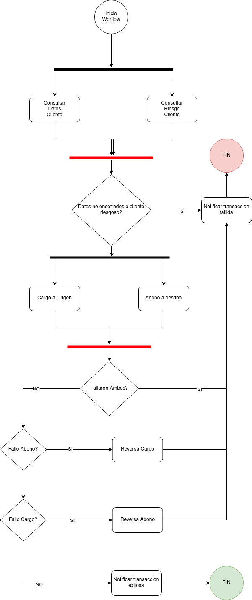

# Workshop Temporal IO
Esta es una guia/workshop de temporal.io desarrollando un caso especifico para un mejor entendimiento de temporal y por que es ideal para el desarrollo de workflows resilentes.

## Caso de uso
El caso de uso que tomaremos es un flujo simplificado de una transferencia electronica, donde aprovecharemos de entender algunos de los conceptos basicos de temporal.



Como se puede ver en el diagrama, este representa una transferencia electronica simplificada donde se realiza en primera instancia una verificacion del cliente que quiere realizar la transferencia y luego se realiza un cargo a la cuenta de origen y un abono a la cuenta de destino.

## Iniciando modulo
Para iniciar el modulo debemos hacer un go mod init.
```sh
$ go mod init github.com/donreno/temporal-io-workshop-2021.
```
Ojo con el nombre del repositorio en caso de que hagas un fork.

## Agregar dependencias
Este workflow depende principalmente solo de 2 librerias `temporal` y `fiber` vamos a instalarlas en nuestro modulo antes de iniciar con los desarrollos.

```bash
$ go get go.temporal.io/sdk
$ go get github.com/gofiber/fiber/v2
```

## Componentes del workflow
Este Workflow esta compuesto por 3 componentes:

### Workflow
Este es el workflow y las actividades que se realizan en este, el codigo de este componente corresponde al diagrama presentado en la seccion de arriba.

### Starter
Este componente se encarga de disparar el inicio de un workflow, en este caso mediante una API REST.

### Worker(s)
Este componente es quien se encarga de ejecutar la logica y las actividades del workflow, como es el componente que se encarga de estas actividades es ideal que para flujos complejos este sea el componente mas escalable.

## Construyendo el workflow

### Workflow
Para construir el workflow iniciaremos desarrollando el workflow y las actividades, para esto en el repositorio ya hay 2 archivos creados previamente para estos 2 casos, `workflow/workflow.go` y `workflow/activities.go`.

### Starter
Para poder iniciar este workflow construiremos una simple API rest con [fiber](https://gofiber.io/), para eso previamente tenemos creado un archivo `starter/main.go`.

### Worker
Finalmente apra que este workflow sea atendido necesitamos desarrollar nuestro worker, para el cual previamente tenemos creado el archivo `worker/main.go`

## Iniciar temporal
Para levantar temporal simplemente hay que utilizar el docker compose que se encuentra en este repo
```bash
$ docker-compose up
```
Para mas detalles sobre este compose revisar [https://github.com/temporalio/docker-compose](https://github.com/temporalio/docker-compose).

## Iniciando starter y worker
Para iniciar el starter
```bash
$ go run ./starter
```
Y para inicial el worker
```bash
$ go run ./worker
```

## Probar workflow
Ahora podemos probar realizando una peticion en nuestra API

```bash
$ curl --location --request POST 'http://localhost:3000/transfer' \
--header 'Content-Type: application/json' \
--data-raw '{
    "origin": "0987654321",
    "destination": "0123456789",
    "amount": 500
}'
```
Probar matando la instancia de worker y/o temporal y volviendo a levantar para observar comportamiento.

Finalmente se pueden ver los resultados de ejecucion del workflow en [http://localhost:8088](http://localhost:8088).
